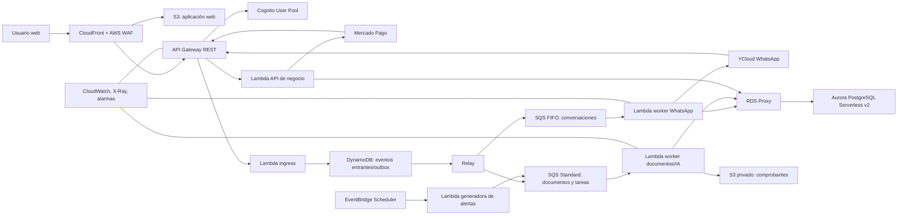

# Plan de arquitectura AWS Serverless — Cuentas a Pagar

## 1. Propósito y alcance

Construir una SaaS multi-tenant de proveedores y cuentas a pagar, operada por WhatsApp en el plan Básico y desde una aplicación web segura en Profesional y Ultra. WhatsApp sigue siendo un canal de captura móvil y notificaciones para todos los planes.

El diseño prioriza:

- información financiera aislada por empresa;
- trazabilidad e idempotencia de mensajes, pagos y alertas;
- operación sin servidores administrados;
- posibilidad de crecer sin rehacer el dominio de negocio;
- una experiencia simple para usuarios informales y empresas con equipo.

No es un sistema bancario: el CBU/CVU es sólo información para que el usuario realice la transferencia fuera de la plataforma. La aplicación no inicia transferencias ni custodia fondos.

## 2. Planes y capacidades

| Capacidad | Básico | Profesional | Ultra |
|---|---|---|---|
| Interfaz principal | WhatsApp | Aplicación web | Aplicación web |
| Captura de foto/PDF por WhatsApp | Sí | Sí | Sí |
| Carga de archivo desde web | No | Sí | Sí |
| Alta de proveedores y facturas | WhatsApp | Web y WhatsApp | Web y WhatsApp |
| Grilla semanal y alerta de próximos pagos | WhatsApp | Web y WhatsApp | Web y WhatsApp |
| Registro de pagos | WhatsApp por usuario autorizado | Web por administrador | Web con flujo de aprobación |
| Dashboard y filtros | No | Sí | Sí |
| Usuarios, roles y auditoría | Usuarios WhatsApp autorizados | Sí | Sí, ampliado |
| Administración de usuarios y roles en web | No | Sí | Sí, ampliada |
| Aprobaciones y auditoría avanzada | No | Básica | Completa |
| Chat IA de lectura | No | No | Sí |

Los límites de facturas mensuales, usuarios/celulares, almacenamiento y consultas IA deben ser parámetros de cada plan, administrados en backend. No deben quedar sólo como texto comercial.

## 3. Reglas de negocio fundamentales

### Proveedores

- Datos obligatorios: `razón social` y `celular`.
- Datos opcionales: CUIT, domicilio, CBU/CVU/alias y banco.
- Un proveedor se asocia a una categoría primaria para métricas. El catálogo inicial contiene:
  - Alquileres y Expensas
  - Gastos Generales
  - Honorarios Profesionales
  - Impuestos y Tasas
  - Librería e Insumos de Oficina
  - Logística y Fletes
  - Mantenimiento y Limpieza
  - Mercadería y Materias Primas
  - Publicidad y Marketing
  - Servicios Públicos (Luz, Gas, Agua, Internet)
- Para no bloquear el alta de un informal, se permite el estado `SIN_CLASIFICAR` de forma transitoria; no se considera una categoría válida para métricas finales. El administrador debe clasificarlo antes de confirmar una factura.

### Facturas y comprobantes informales

- Una factura puede ser fiscal A/C o un comprobante informal descriptivo.
- Toda captura crea primero un `InvoiceDraft`; sólo un usuario autorizado la confirma como factura incluida en la grilla.
- Se conservan origen, archivo, hash, MIME, fecha de captura y datos extraídos/corregidos. No se expone el archivo como URL pública.
- La prevención de duplicados combina identificador del documento, proveedor, tipo/número cuando exista y hash del archivo. Las coincidencias se presentan para revisión; no se elimina una factura automáticamente.

### Pagos

- Una operación de pago (`PaymentBatch`) puede contener una o más facturas.
- Cada factura se paga por su importe total; no hay pagos parciales.
- Una transacción PostgreSQL valida que todas las facturas pertenecen al tenant, están pendientes, no están canceladas ni pagadas, y las marca como pagadas junto con la operación.
- La anulación de una factura o reversión de pago conserva historial; nunca borra la información financiera.
- En Básico, sólo un número WhatsApp autorizado como administrador puede registrar un pago.
- En Profesional, el `OPERADOR_CARGA` no registra ni modifica pagos. El administrador los registra.
- En Profesional y Ultra, `OPERADOR_PAGOS` puede crear una propuesta de pago; sólo un administrador la aprueba y registra. Un pago iniciado por el propio administrador no requiere una aprobación adicional. Ultra puede activar políticas avanzadas, como "quien propone no aprueba".

### Alertas de pago

- Cada tenant configura zona horaria, días, hora, anticipación (por defecto 24 horas), destinatarios y si desea detalle/total.
- El administrador puede editar la configuración sin redeploy.
- Una alerta tiene una clave idempotente por `tenant + usuario + ventana de pago + configuración`; una repetición del scheduler no produce otro WhatsApp.
- Las alertas proactivas usan una plantilla de utilidad aprobada por WhatsApp/YCloud cuando corresponda.

## 4. Arquitectura de destino

### 4.1 Dominios y transición de YCloud

- `apagar.averiq.cloud` es el webhook existente de YCloud. Se mantiene como endpoint legado hasta que `https://apagar.averiqsj.com` esté operativo, autenticado y probado con eventos reales. El cambio de URL se hará en YCloud con una ventana de rollback; no se reasigna ni elimina el endpoint anterior antes de validarlo.
- La nueva aplicación se publicará en `https://apagar.averiqsj.app`. En producción, CloudFront atenderá la web y la ruta `/api` se distribuirá a API Gateway detrás de CloudFront, evitando exponer un nombre adicional de API al usuario final.
- Hostinger administra el DNS actual. Para CloudFront no se configura una IP fija mediante registro A: se crea un CNAME del subdominio hacia el nombre de distribución que entrega AWS. ACM en `us-east-1` agrega CNAMEs de validación del certificado. El TLD `.app` está en la lista HSTS preload: HTTPS debe estar correctamente habilitado antes de publicar cualquier host bajo `averiqsj.app`. No se mueve ni reemplaza el sitio institucional.



### Servicios elegidos

| Necesidad | Servicio | Motivo |
|---|---|---|
| Web estática | S3 + CloudFront | Sin servidor, rápida y con WAF delante |
| Login | Cognito User Pools | Email, Google/Facebook opcionales, MFA/passkeys y JWT |
| API pública y webhooks | API Gateway REST + Lambda | Autorización, límites y WAF sin servidor |
| Base transaccional | Aurora PostgreSQL Serverless v2 + RDS Proxy | PostgreSQL, transacciones de pago y escalado administrado |
| Archivos | S3 privado | Durabilidad, cifrado y cargas directas controladas |
| Colas | SQS FIFO y Standard + DLQ | Orden por conversación y tareas paralelas resilientes |
| Eventos idempotentes | DynamoDB + Streams/outbox | Registro condicional rápido antes de procesar |
| Recordatorios | EventBridge Scheduler | Zona horaria, reintentos y DLQ |
| Secretos | Secrets Manager + KMS | Rotación y acceso mínimo por función |
| Infraestructura | CDK TypeScript | IaC versionada y reproducible |

Aurora Serverless v2 es la opción PostgreSQL serverless del diseño. En producción se define una capacidad mínima que respete el objetivo de disponibilidad; escalar a cero/autopause sólo se evalúa para desarrollo o cargas que toleren demora de reanudación.

## 5. Identidad, autenticación y autorización

### Usuarios web

Cognito User Pools administra la identidad:

- email y contraseña con email verificado;
- inicio de sesión social opcional con Google y Facebook;
- MFA o passkeys/WebAuthn para administradores;
- tokens JWT de corta duración y refresh-token revocable.

La autorización de negocio vive en PostgreSQL. Cognito no representa tenants con grupos por empresa. La API toma el `sub` validado del JWT y consulta la membresía correspondiente:

```text
ApplicationUser(cognitoSub, email, estado)
TenantMembership(userId, tenantId, role, estado)
WhatsAppIdentity(userId, tenantId, provider, bsuid, phone, verifiedAt)
```

Roles iniciales:

- `ADMIN`: usuarios, configuración, proveedores, confirmación de facturas, pagos, alertas y suscripción.
- `OPERADOR_CARGA`: carga archivos/datos y corrige sus borradores; no confirma facturas, no gestiona pagos ni usuarios.
- `OPERADOR_PAGOS` (Profesional/Ultra): propone o carga pagos sin aprobarlos.

Todas las consultas y mutaciones filtran por el tenant autorizado. El `tenantId` enviado por navegador nunca otorga acceso por sí mismo. PostgreSQL Row-Level Security se incorpora como segunda barrera una vez estabilizado el acceso desde Prisma.

### Usuarios de WhatsApp

En Básico, la identidad WhatsApp verificada define qué personas pueden operar. En Profesional/Ultra se vincula al usuario web mediante un desafío de un uso y vencimiento corto, codificado en un QR/deep link `wa.me`.

El QR no vincula un dispositivo ni WhatsApp Web; vincula el remitente verificado por el webhook YCloud con un usuario autenticado de la aplicación. Se almacenan teléfono y BSUID de YCloud, no sólo teléfono.

## 6. Flujos principales

### 6.1 Mensaje/captura por WhatsApp

1. YCloud entrega el webhook a API Gateway.
2. `webhook-ingress` verifica autenticidad sobre el cuerpo original, valida el esquema y registra el evento con una condición única `provider + externalMessageId` en DynamoDB.
3. El evento durable se publica mediante el outbox/relay. Si falla la publicación, el relay lo reintenta: no existe una ventana en la que un mensaje quede marcado como recibido pero se pierda antes de encolarse.
4. Los mensajes conversacionales van a SQS FIFO con `MessageGroupId` igual a la identidad WhatsApp. Una conversación se procesa en orden; conversaciones distintas escalan en paralelo.
5. Si contiene archivo, el worker descarga el medio desde YCloud, valida tamaño/MIME/firma del archivo, lo guarda en S3 privado y crea un `InvoiceDraft`.
6. Un worker de documentos procesa OCR/extracción de forma asíncrona. El resultado queda como propuesta revisable, nunca como pago o factura irreversible sin validación.
7. El bot responde con estado, siguiente paso o pedido de corrección.

### 6.2 Carga desde web

1. El usuario Cognito pide crear una carga.
2. La API autoriza el tenant y crea un borrador `UPLOADING`.
3. Devuelve una URL prefirmada de S3 limitada a tipo, tamaño, prefijo y vencimiento.
4. El navegador carga directamente a S3; un evento crea el trabajo de documento en SQS Standard.
5. El mismo worker y la misma entidad `InvoiceDraft` procesan la carga. No hay una segunda lógica de OCR para la web.

La recepción automática de correos queda fuera de alcance. Un usuario puede descargar un adjunto recibido por email y subirlo desde la web.

### 6.3 Pago de una o varias facturas

1. El administrador selecciona una o más facturas elegibles.
2. La API crea una operación con una `idempotencyKey` de interfaz y muestra el resumen.
3. En una única transacción, valida las facturas y crea `PaymentBatch` y `PaymentItem`; actualiza sus estados a `PAGADA`.
4. Inserta una notificación en `OutboundMessage` dentro de la misma transacción.
5. Un worker de salidas envía una sola constancia por la operación, registra el ID YCloud y procesa sus estados entregado/leído/fallido.

En Ultra, el paso 3 se divide en propuesta y aprobación. Ningún reintento de HTTP, SQS o YCloud puede duplicar una operación o una constancia.

### 6.4 Recordatorios

1. EventBridge Scheduler ejecuta el generador por tenant según `America/Argentina/Buenos_Aires` y la configuración editable.
2. El generador consulta facturas pendientes para la ventana configurada y crea registros `NotificationIntent` únicos.
3. El worker de salidas entrega el mensaje usando la plantilla adecuada y actualiza su estado.
4. Si falla el scheduler, aplica política de reintentos y DLQ; si falla el envío, la notificación queda reintentable sin crear una segunda alerta.

### 6.5 Suscripción SaaS mediante Mercado Pago Checkout Pro

1. El administrador elige plan o renovación.
2. La API calcula precio, moneda y vigencia en servidor; crea una `SubscriptionOrder` pendiente con referencia interna única.
3. Crea una preferencia de Checkout Pro desde backend con `external_reference`; nunca toma importe o plan desde el navegador.
4. Redirige al `init_point` de Mercado Pago.
5. El webhook de Mercado Pago se autentica, se deduplica, consulta el recurso del proveedor y sólo entonces actualiza `Subscription`, período y capacidad habilitada en una transacción.

**Decisión explícita:** Checkout Pro es apropiado para un cobro iniciado por el cliente, por ejemplo alta o renovación mensual manual. Si el negocio requiere débito mensual automático, se debe integrar el producto de Suscripciones/Preapproval de Mercado Pago; no se debe simular recurrencia con una preferencia vieja de Checkout Pro. No se guardan tarjetas ni tokens de tarjeta.

## 7. Modelo de datos principal

```text
Tenant ──< TenantMembership >── ApplicationUser
Tenant ──< Supplier ──< SupplierBankAccount
Supplier ── Category
Tenant ──< InvoiceDraft ──< Document
Tenant ──< Invoice
PaymentBatch ──< PaymentItem >── Invoice
Tenant ──< PaymentGridConfig
Tenant ──< NotificationIntent ──< OutboundMessage
Tenant ──< Subscription ──< SubscriptionOrder
```

Entidades de confiabilidad obligatorias:

- `InboundEvent`: ID proveedor, hash, recibido, estado y metadatos mínimos.
- `IdempotencyKey`: operaciones HTTP que cambian estado.
- `OutboundMessage`: efecto lógico, destinatario, estado, reintentos e ID externo.
- `AuditEvent`: quién hizo qué, sobre qué entidad, origen y fecha.

Índices mínimos: tenant+estado+vencimiento, tenant+fecha programada, tenant+proveedor, identificador de webhook único, hash de archivo y operaciones de pago por factura.

## 8. Seguridad y protección de datos

- Una cuenta AWS por ambiente: `dev`, `staging` y `prod`; datos, claves, proveedores y dominios separados.
- AWS WAF con rate limiting y reglas administradas delante de CloudFront/API Gateway.
- Roles IAM separados por Lambda y mínimo privilegio. El API web no puede leer secretos de Mercado Pago/YCloud si no los necesita.
- Secrets Manager para claves y tokens; sin `.env` productivo, secretos en repositorio ni logs.
- S3 bloqueado al público, SSE-KMS, lifecycle, acceso por URL prefirmada y escaneo/cuarentena de archivos antes de disponibilizarlos.
- Aurora cifrada con KMS; CBU/CVU y otros datos bancarios se muestran enmascarados por defecto y se cifran a nivel de aplicación si el análisis de riesgo lo exige.
- Logs estructurados sin cuerpos completos de mensajes, CBU, CUIT, archivos ni secretos. Retención y acceso a logs definidos por ambiente.
- Validación de firmas de YCloud y Mercado Pago sobre el payload original; allow-list de IP sólo como defensa adicional, no como autenticación.
- Auditoría de accesos, cambios de proveedor, facturas, pagos, roles y suscripciones.

## 9. Concurrencia, reintentos y DLQ

- SQS FIFO preserva el orden de una conversación; aun así todos los handlers son idempotentes porque Lambda puede reprocesar eventos.
- SQS Standard para documentos, IA, notificaciones y tareas que no requieren orden.
- `batchItemFailures` en workers para no reprocesar ítems exitosos de un lote.
- Timeout de visibilidad de SQS: al menos seis veces el timeout de Lambda, más la ventana de batching si aplica.
- Reintentos con backoff y jitter sólo para errores transitorios; errores de validación, archivo prohibido o datos imposibles van a revisión/DLQ sin reintento infinito.
- DLQ separada por flujo: conversaciones, documentos, notificaciones, scheduler y pagos. Cada una tiene alarma y runbook de corrección/replay seguro.
- Reserved concurrency y máximo de workers limitan conexiones a Aurora y gasto de IA.

## 10. IA para Ultra y extracción de documentos

La IA no recibe acceso directo a PostgreSQL ni puede ejecutar escrituras, pagos o cambios de plan.

- **Extracción de documentos:** produce un esquema estructurado validado y un puntaje/confianza; si hay dudas, deja borrador para revisión.
- **Chat Ultra:** un servicio backend transforma preguntas permitidas en consultas agregadas tenant-aware y entrega al modelo sólo los resultados mínimos necesarios.
- El chat es de sólo lectura, aplica cuota por tenant, guarda auditoría, versión de prompt, latencia, tokens y costo.
- Implementar un adaptador de proveedor para evaluar Amazon Bedrock y OpenAI con datos de prueba reales; elegir por precisión de comprobantes en español, latencia, privacidad y costo, no por preferencia teórica.

## 11. Observabilidad y operación

Métricas y alarmas mínimas:

- webhooks recibidos, autenticados, deduplicados y fallidos;
- edad de mensajes, mensajes visibles, errores y contenido de cada DLQ;
- borradores creados, facturas confirmadas, pagos registrados, constancias entregadas/fallidas y alertas enviadas;
- tiempo de proceso de documentos y tasa de corrección manual;
- errores, throttles, duración y concurrencia Lambda;
- conexiones, CPU/memoria, capacidad ACU y latencia de Aurora/RDS Proxy;
- errores de Cognito, 4XX/5XX API, WAF bloqueos y disponibilidad sintética;
- gasto de AWS e IA por ambiente/tenant.

Usar un identificador de correlación desde el webhook hasta el pago/notificación. `tenantId` vive en logs, no como dimensión de métrica de alta cardinalidad.

## 12. Costos y escalabilidad

Los componentes que más deben vigilarse no serán necesariamente Lambda: Aurora Serverless v2 con capacidad mínima, NAT Gateway para salidas a YCloud/Mercado Pago/IA, RDS Proxy, WAF, CloudWatch y almacenamiento pueden ser costos base relevantes.

Medidas:

- AWS Budgets y Cost Anomaly Detection por ambiente;
- límites de concurrencia y cuotas de IA;
- lifecycle S3 para originales, cuarentena y archivos antiguos;
- VPC endpoints para S3, DynamoDB, Secrets Manager y CloudWatch cuando el análisis de costo lo justifique; NAT altamente disponible para dependencias externas;
- dimensionar Aurora con métricas reales; no asumir que "serverless" significa costo cero;
- reservar provisioned concurrency sólo para rutas cuya latencia real lo justifique. El webhook responde rápido tras persistir/encolar, por lo que no necesita esperar OCR.

## 13. Infraestructura, deployment y rollback

- CDK TypeScript define todos los recursos, IAM, alarmas, dominios y políticas.
- CI/CD con GitHub Actions OIDC o CodePipeline: sin claves AWS permanentes en CI.
- Artefacto inmutable promovido de dev a staging y producción; pruebas unitarias, integración, contrato de webhooks y E2E.
- Lambda versions/aliases y despliegue canary para API/workers; feature flags por tenant para activar web, pagos o IA de forma gradual.
- Migraciones PostgreSQL corren como job controlado, no al iniciar Lambda. Usar expand/contract para que un rollback de código no rompa la base.
- Rollback de aplicación: volver alias/feature flag. Rollback de datos: restauración/PITR es último recurso; no se revierte una migración destructiva automáticamente.
- Backups automáticos, point-in-time recovery y restauración probada periódicamente. Multi-AZ protege la disponibilidad regional, no reemplaza una estrategia de recuperación regional si el RTO/RPO futuro la exige.

## 14. Fases de implementación

### Fase A — Fundaciones y dominio

1. Definir precios, límites, período de gracia, retención de datos y política de cancelación. Decisiones iniciales: ARS 28.000/82.000/144.000 por mes, prueba de siete días y bloqueo de operatoria por siete días antes de revocar el acceso.
2. Modelar tenants, memberships, roles, proveedores, categorías, facturas, pagos por lote, borradores y auditoría.
3. Implementar invariantes: no parcialidad, pagos atómicos, borrado lógico, aislamiento de tenant e idempotencia.
4. Crear ambientes AWS con CDK, KMS, Secrets Manager, CloudWatch y presupuestos.

### Fase B — Básico WhatsApp serverless

1. API Gateway REST, webhook YCloud autenticado y DynamoDB de eventos.
2. Outbox + SQS FIFO + worker conversacional.
3. Aurora Serverless v2, RDS Proxy y S3 privado para documentos.
4. Alta de proveedores, facturas, grilla, pagos totales por lote y alertas editables.
5. DLQ, métricas, backups y pruebas de duplicados/reintentos.

### Fase C — Suscripciones

1. Checkout Pro para altas/renovaciones manuales, con webhooks verificados y conciliación.
2. Habilitación de plan únicamente tras pago confirmado server-side.
3. Definir separadamente si habrá cobro recurrente automático mediante Suscripciones de Mercado Pago.

### Fase D — Profesional web

1. SPA en S3/CloudFront y Cognito.
2. Usuarios, membresías, roles e invitaciones.
3. Carga web y flujo común de borradores.
4. Grilla, pagos por administrador, métricas y filtros de estados incluyendo canceladas.
5. Vinculación opcional de WhatsApp por QR/deep link.

### Fase E — Ultra

1. Propuestas y aprobaciones de pago; auditoría reforzada.
2. Configuración y reportes ampliados.
3. Chat IA de sólo lectura, cuotas, guardrails y evaluación de calidad/costo.

### Fase F — Piloto, operación y expansión

1. Ejecutar pruebas de carga, seguridad, replay de DLQ y restauración.
2. Migrar un tenant completo por vez; nunca repartir las escrituras de un tenant entre dos plataformas.
3. Medir correcciones, latencia, costo y uso para ajustar límites/planes.
4. Retirar infraestructura antigua sólo tras un período acordado de estabilidad.

## 15. Decisiones pendientes

Estas decisiones no deben bloquear el diseño base, pero sí deben cerrarse antes de producción:

1. Límite de almacenamiento y de consultas IA por plan.
2. Frecuencia y texto de los avisos desde el día cinco de prueba.
3. Política definitiva de retención/eliminación de datos y reactivación, pendiente de asesoramiento legal.
4. Si la doble aprobación será obligatoria en Ultra.
5. Requerimientos legales/fiscales y plazo de retención de comprobantes/auditoría. Región inicial: `us-east-1`.
6. Volumen objetivo de mensajes, documentos, tamaño máximo de archivo y RPO/RTO.
7. Política para categorías: una categoría primaria por proveedor, y si una factura podrá excepcionalmente sobrescribirla.
